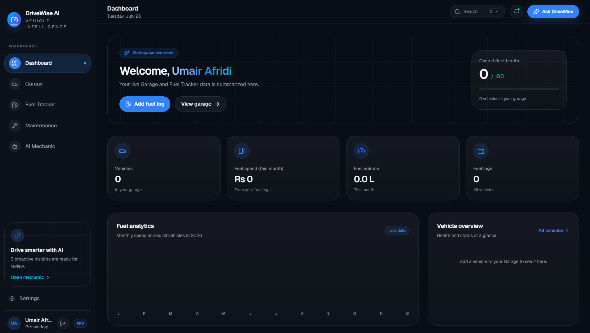
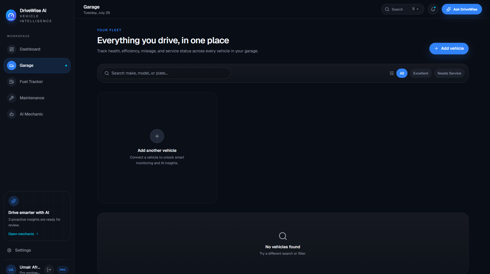
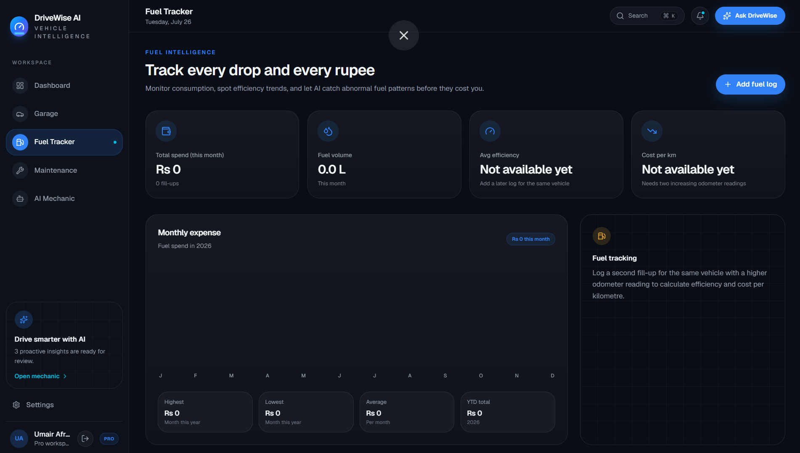
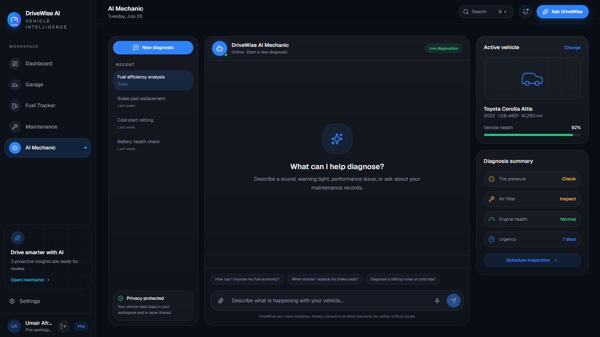
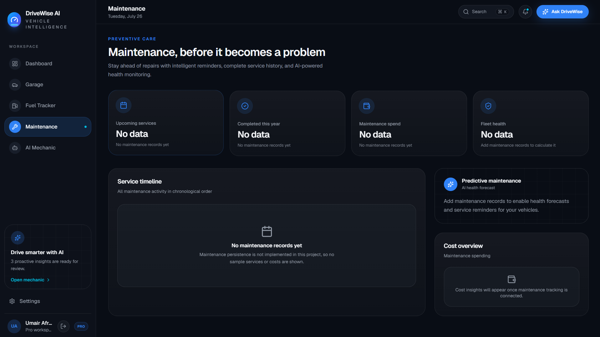

# 🚗 DriveWise AI

An AI-powered vehicle management web application that helps users organize their vehicles, monitor fuel usage, and receive intelligent maintenance guidance through Google Gemini AI.

## 🌐 Live Demo

**Live Website:** https://drive-wise-ai.vercel.app/

**GitHub Repository:** https://github.com/UmairAfridii/drive-wise-ai

---

# 📖 Project Overview

DriveWise AI is a modern web application designed to simplify vehicle management for everyday drivers.

Managing multiple vehicles, tracking fuel expenses, remembering service schedules, and understanding mechanical problems can become difficult. DriveWise AI combines these tasks into one intelligent platform while providing AI-powered assistance for vehicle-related questions.

The application is built with a modern full-stack architecture using Next.js, Firebase, Tailwind CSS, and Google Gemini AI.

---

# 🎯 Problem Statement

Many vehicle owners keep maintenance records, fuel history, and service information in notebooks or different mobile applications.

This makes it difficult to:

- Track fuel consumption
- Monitor vehicle history
- Organize multiple vehicles
- Receive quick maintenance guidance
- Manage all vehicle information in one place

DriveWise AI solves this problem by providing a centralized, AI-powered vehicle management platform.

---

# ✨ Features

## 🔐 User Authentication

- Secure Sign Up
- Secure Login
- Firebase Authentication
- User-specific data protection

---

## 🚗 Garage Management

Users can:

- Add vehicles
- View vehicle information
- Update vehicle details
- Delete vehicles
- Manage multiple cars in one garage

---

## ⛽ Fuel Tracker

The Fuel Tracker allows users to:

- Record fuel purchases
- Track fuel history
- Monitor fuel expenses
- Calculate fuel usage
- View organized fuel records

---

## 🤖 AI Mechanic

DriveWise AI includes an intelligent AI Mechanic powered by Google Gemini.

Users can ask questions such as:

- Why is my engine overheating?
- My car makes a clicking sound.
- Why is my fuel consumption increasing?
- My steering wheel vibrates.
- Brake warning light is on.

The AI analyzes the user's issue and provides helpful maintenance guidance, possible causes, and recommended next steps.

---

## 🛠 Maintenance Management

The application includes a dedicated maintenance section for organizing vehicle service information and supporting better vehicle management.

---

## 📊 Dashboard

The Dashboard provides a clean overview of the application with quick navigation to all available modules.

---

## ⚙ Settings

Users can access application settings and manage their account experience.

---

# 🤖 AI Feature

DriveWise AI integrates Google's Gemini AI to provide intelligent vehicle assistance.

Instead of simply answering questions, the AI acts like a helpful automotive assistant capable of understanding common vehicle problems and offering useful guidance.

The AI responses are generated dynamically based on the user's question.

## AI Model

- Google Gemini
- Gemini Flash Model

## AI Capability

- Vehicle troubleshooting
- Maintenance guidance
- Mechanical advice
- Fuel efficiency suggestions
- General automotive knowledge

---

# 🧠 AI System Prompt

The AI is instructed to behave as a professional automotive assistant.

It is designed to:

- Understand vehicle-related questions
- Explain issues in simple language
- Suggest possible causes
- Recommend maintenance actions
- Avoid unsafe or misleading advice
- Encourage users to consult a qualified mechanic for serious problems

---

# 🛠 Technologies Used

## Frontend

- Next.js
- React
- TypeScript
- Tailwind CSS

## Backend

- Firebase Authentication
- Cloud Firestore

## Artificial Intelligence

- Google Gemini API

## Deployment

- Vercel

## Version Control

- Git
- GitHub
---

# 📸 Application Screenshots

## Dashboard



---

## Garage Management



---

## Fuel Tracker



---

## AI Mechanic



---

## Maintenance Module



---

# 🚀 How to Run the Project

## 1. Clone the Repository

```bash
git clone https://github.com/UmairAfridii/drive-wise-ai.git
```

## 2. Open the Project

```bash
cd drive-wise-ai
```

## 3. Install Dependencies

```bash
npm install
```

## 4. Create Environment Variables

Create a `.env.local` file and add the required Firebase and Gemini API keys.

## 5. Start the Development Server

```bash
npm run dev
```

The application will be available at:

```
http://localhost:3000
```

---

# 📂 Project Structure

```
drive-wise-ai
│
├── app/
├── components/
├── lib/
├── public/
├── screenshots/
├── package.json
├── next.config.mjs
└── README.md
```

---

# 🧩 Tools & Services Used

- Next.js
- React
- TypeScript
- Tailwind CSS
- Firebase Authentication
- Cloud Firestore
- Google Gemini API
- Git
- GitHub
- Vercel
- Visual Studio Code

---

# 🎯 Target Users

DriveWise AI is designed for:

- Individual vehicle owners
- Students
- Families with multiple vehicles
- Drivers who want organized vehicle records
- Anyone seeking quick AI-powered vehicle guidance

---

# 🌍 Real-World Impact

DriveWise AI helps users keep all important vehicle information in one place while using Artificial Intelligence to make vehicle maintenance guidance more accessible and organized.

The application improves convenience by reducing the need to manage fuel records, vehicle information, and maintenance notes across multiple platforms.
---

# 🔮 Future Improvements

DriveWise AI can be expanded with additional features such as:

- Service reminders and notifications
- Maintenance history reports
- Vehicle document management
- Fuel cost analytics and charts
- AI maintenance scheduling
- Multi-language support
- Cloud backup and synchronization
- Mobile application version

---

# 📚 Learning Outcomes

This project provided hands-on experience with:

- Full-stack web application development
- Firebase Authentication
- Cloud Firestore database operations
- REST API integration
- Google Gemini AI integration
- Responsive UI design
- State management in React
- Git and GitHub version control
- Deployment with Vercel

---

# 👨‍💻 Author

**Muhammad Umair**

BS Computer Science Student

GitHub: https://github.com/UmairAfridii

---

# 🙏 Acknowledgements

Special thanks to:

- Google Gemini AI
- Firebase
- Next.js
- React
- Tailwind CSS
- Vercel
- GitHub

for providing the technologies that made this project possible.

---

# 📄 License

This project is developed for educational purposes as part of a university AI application development final project.

---

## ⭐ Conclusion

DriveWise AI demonstrates how Artificial Intelligence can be combined with modern web technologies to build a practical vehicle management solution.

The project brings together authentication, cloud data storage, fuel tracking, vehicle management, and AI-powered assistance into a single, user-friendly platform. It reflects modern full-stack development practices while addressing a real-world problem with an intuitive and responsive user experience.
